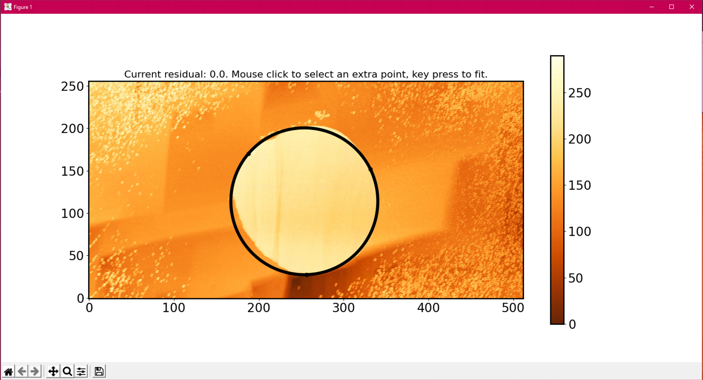
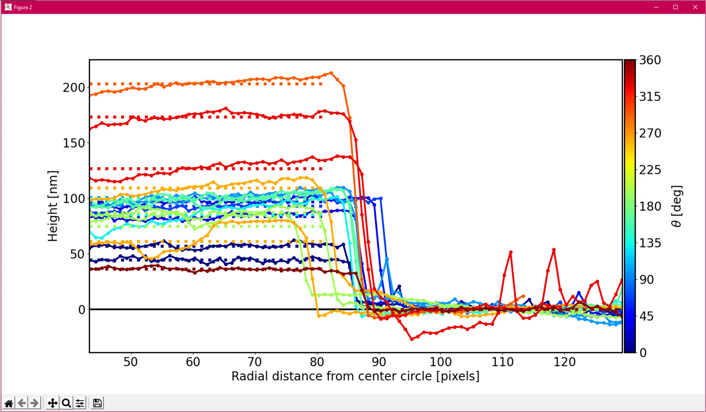

afmstepdetection

Harmen Hoek  
December 2020  
Latest release: 17-12-2020 (V1) 
Created for: Physics of Complex Fluids, University of Twente.

## About
This is a program for analyzing circular steps `.spm` files originating from the AFM. The steps are circular plateaus. 
When ran, the user is prompted with a GUI with settings. When pressed 'RUN', the program reads the data and allows the user
to select the circular plateau in a GUI. The program then interpolates de surface, and in a polar-wise manner the steps are
extracted. To each step a plateau is fitted to the high and low side, and plotted. All extracted data and settings are
automatically saved in a `.csv` file.

The program is written in Python 3.8, and requires additional libraries including matplotlib, scipy, json, csv and numpy. 
The entire program is compiled into a Windows executable `.exe`.

## Getting Started
Download the `dist/*.exe` file. In the same folder add the `data\*.spm` data file and run the program.

When the program is running:
1. Check the settings (see Settings below).
2. Press `RUN`.
3. Select 3 points on the edge of the step. After selecting 3 a circle will be fitted. Ad more points to refine the circle fit, or press `ENTER` to continue.
4. The program will produce 2 figures. Figure 1 (named Figure 2) will visually show the steps and the fitting region. Figure 2 (named Figure 3) will show the step crosssections, where each step is normalized by setting the lower fit at 0.
5. The program will create a `.csv` and `.json` file will all the extracted data and settings in the same folder as the program. Please note that it does overwrite any previously saved `.csv` files if the name is not unique.

### Settings
| Setting        | Description
| --------------- |:-------------|
| Input filename      | The path to the datafile to be analyzed.
| Output filename      | The csv and json are save with filename output.csv and output.json defined here.       
| Image width | Width of the `.spm` AFM image. Defined in the file (will be done automatically in future releases)
| Image width | Height of the `.spm` AFM image. Defined in the file (will be done automatically in future releases)
| r_start | Each step line originates in the center. `r_start` defines the distance from the center where the step line will start, defined as a fraction of the radius R.
| r_end | `r_end` defines the distance from the center where the step line will end, defined as a fraction of the radius R.
| Theta step size | Degrees between each step.
| Custom theta | If checked, `Theta step size` will be ignored and `Custom theta range` will be used.
| Custom theta range | Custom range of angles between the steps in degrees, where theta=0 is at 3 o'clock and CCW (see image below). Space seperated array.
| Fit offset | Each step line is fitted at high and low end. Fit offset defines distance from R (in data points / pixels) where fitting will start. So each step is fitted from `r_start*R to R-fit_offset` and `R+fit_offset to r_end*R`.
| Residual threshold | Some basic filtering is done on the fits. If the res. is above the set threshold, the entire step is ignored in plotting and data output. 

## Example

Main program interface with settings: 

3 points are selected for a circle fit: 

The 2 figures that are created:  

The output csv:  

## Further Development
The current release is quick and dirty. Many things to improve. Including:

* Reduce compiled version size and increase speed by not compiling all Matplotlib packages.
* Error handling. Currently no checks are done to verify the input data and no error handling is done, so program might crash.
* Option to save settings (currently settings are reset every time).
* Include oval fitting or even drawn line.
* Automate plateau selection.
* Automate reading width and height from input file.
* Auto save figures.
* Unique naming of output files.
* File select popup.
* Give feedback to user in program when running.